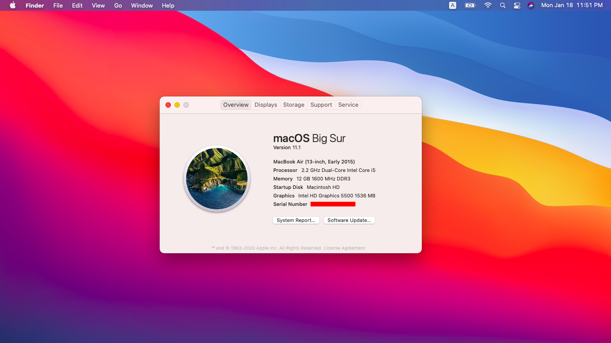

# ACER Aspire E5-471G Hackintosh OpenCore

---

硬件|型号
---|:--:
CPU|i5 5200u
集显|intel hd5500
内存|三星DDR3 12G(原配4G太小,可以自行加多一条内存)
声卡|Realtek ALC283
独显|NVIDIA 840M
有线网卡|Realtek rtl8188
---

## 工作：
集成显卡&radic;

1080P输出&radic;

有线网卡&radic;

HDMI&radic;

VGA&radic;

声卡&radic;

摄像头&radic;

## 不工作:
wifi&蓝牙&times; (可以在咸鱼上收一个BCM94352HMB，wifi直接免驱，蓝牙放入三个kext就可以了)

睡眠&times;

多点触控I2C&times;（ACPI缺少过多）

读卡器&times;

## 安装镜像:
https://blog.daliansky.net/macOS-BigSur-11.1-20C69-Release-version-with-Clover-5127-original-image-Double-EFI-Version-UEFI-and-MBR.html

## 安装方法:
安装黑果小兵的方法把镜像刻录到u盘，然后挂载EFI分区，将这个github的EFI文件夹直接替换，然后引导u盘安装

## 注意：
 **WARNING⚠️** 请勿用于引导windows(acpi部分不规范)
+ 触摸板请在bios里面把驱动改成basic，不要用Advance,不然键盘和触摸板会挂
+ 如果你没有换无线网卡，请把EFI/OC/Kexts/下的&nbsp;&nbsp;BrcmBluetoothInjector.kext&nbsp;&nbsp;BrcmFirmwareData.kext BrcmPatchRAM3.kext&nbsp;&nbsp;删掉，免得启动不了
+ VoodooPS2Controller.kext&nbsp;这个驱动不建议用acidanthera的新版，触摸板会不可用
+ 有一定概率会在连接hdmi启动时亮度重置，原因未知
+ USBInjectAll.kext&nbsp;是根据主板定制好的，不要更换成其他
+ 我认为电池电量是不准的
+ 如果你想进入acer bios的高级选项，可以进行这个骚操作：f2进入bios，按住fn+tab三秒，保存退出，再次f2进入bios，就可以看见Advance选项和power选项
+ 请把序列号信息换成你自己的

## 说明:

SSDT-EHCx_OFF.aml 禁用EHC1和EHC2，同等于EHC1 -> EH01 ,EHC2 to EH02

SSDT-PNLF.aml 背光亮度控制补丁

SSDT-XOSI.aml 操作系统方法补丁，缺少引导卡住

SSDT-Fn.aml fn亮度按键

SSDT-HRTfix.aml HPET,RTC,TIM三合一修复补丁(主要IRQ修复)

---

